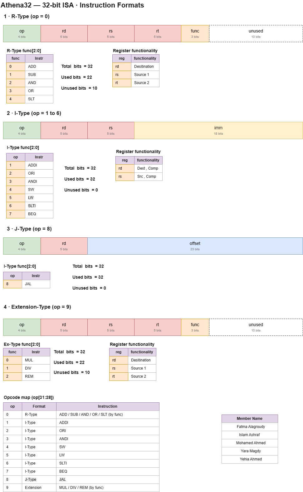
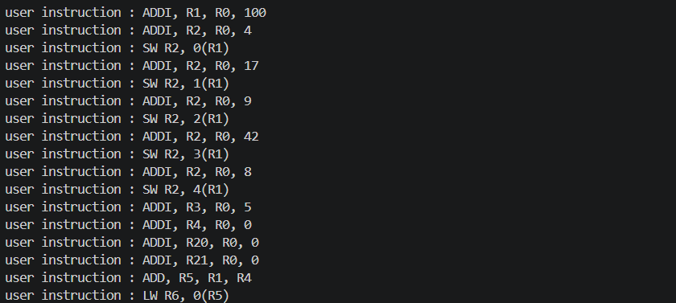
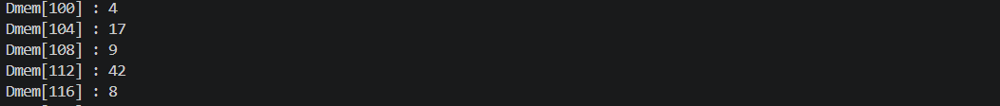
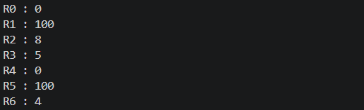

# Athena32 — A 32-bit RISC Instruction Set Architecture

## 1. Introduction

Athena32 is a custom 32-bit RISC instruction set architecture (ISA) that we
designed and implemented from scratch as a team project.

The design follows a classic load/store RISC model. All arithmetic and logic
operations work on registers only, and memory is accessed through the `LW` and
`SW` instructions. Every instruction is exactly 32 bits wide, which keeps the
fetch and decode stages simple.

Main features:

- **32 general-purpose registers**, each 32 bits wide (`R0` is always zero)
- **Fixed 32-bit instruction width** with four instruction formats
- **16 instructions**: a base integer set plus the Multiply/Divide (M) extension
- **Big-endian** byte order
- **Strict trap** behaviour on illegal operations

---

## 2. ISA Design

The figure below shows the four instruction formats, the function codes, and
the full opcode map.



### Instruction formats

| Format | Opcode | Layout |
|---|---|---|
| R-Type | `0` | `op[31:28]` `rd[27:23]` `rs[22:18]` `rt[17:13]` `func[12:10]` `unused[9:0]` |
| I-Type | `1`–`7` | `op[31:28]` `rd[27:23]` `rs[22:18]` `imm[17:0]` |
| J-Type | `8` | `op[31:28]` `rd[27:23]` `offset[22:0]` |
| Extension | `9` | same layout as R-Type |

### Opcode map

| op | Format | Instruction |
|---|---|---|
| 0 | R-Type | `ADD` / `SUB` / `AND` / `OR` / `SLT` (selected by `func`) |
| 1 | I-Type | `ADDI` |
| 2 | I-Type | `ORI` |
| 3 | I-Type | `ANDI` |
| 4 | I-Type | `SW` |
| 5 | I-Type | `LW` |
| 6 | I-Type | `SLTI` |
| 7 | I-Type | `BEQ` |
| 8 | J-Type | `JAL` |
| 9 | Extension | `MUL` / `DIV` / `REM` (selected by `func`) |
| 10–15 | — | free for future instructions |

---

## 3. Test Program

To test the design, we wrote a program that uses most of the instruction set in
one place. The program builds an array of five values in memory, then walks
through it in a loop to compute the sum and the maximum value.

The program covers:

- Arithmetic and logic instructions (`ADDI`, `ADD`, `SUB`, `ANDI`, `ORI`)
- Memory access (`LW`, `SW`)
- Comparison and control flow (`SLT`, `BEQ`)
- The M extension (`MUL`, `DIV`, `REM`)

The first part of the program is listed below. The array is written to
`MEM[100]` up to `MEM[104]`, and the loop then starts reading it back.

### Program and Expected results

```
10800064  ADDI R1, R0, 100             R1 = 0x00000064
11000004  ADDI R2, R0, 4               R2 = 0x00000004
41040000  SW R2, 0(R1)                 MEM[100] = 0x00000004
11000011  ADDI R2, R0, 17              R2 = 0x00000011
41040001  SW R2, 1(R1)                 MEM[101] = 0x00000011
11000009  ADDI R2, R0, 9               R2 = 0x00000009
41040002  SW R2, 2(R1)                 MEM[102] = 0x00000009
1100002A  ADDI R2, R0, 42              R2 = 0x0000002A
41040003  SW R2, 3(R1)                 MEM[103] = 0x0000002A
11000008  ADDI R2, R0, 8               R2 = 0x00000008
41040004  SW R2, 4(R1)                 MEM[104] = 0x00000008
11800005  ADDI R3, R0, 5               R3 = 0x00000005
12000000  ADDI R4, R0, 0               R4 = 0x00000000
1A000000  ADDI R20, R0, 0              R20 = 0x00000000
1A800000  ADDI R21, R0, 0              R21 = 0x00000000
02848000  ADD R5, R1, R4               R5 = 0x00000064
53140000  LW R6, 0(R5)                 R6 = 0x00000004
```

## 4. Results

### 4.1 Disassembly



### 4.2 Data Memory



### 4.3 Register File



---

## 7. Team

| Member |
|---|
| Fatma Alagroudy |
| Islam Ashraf |
| Mohamed Ahmed |
| Yara Magdy |
| Yehia Ahmed |