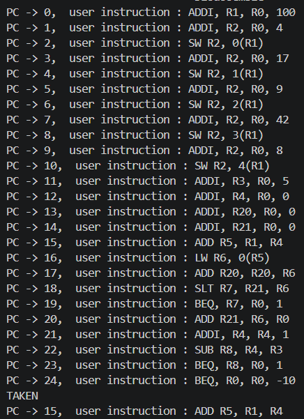
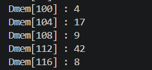
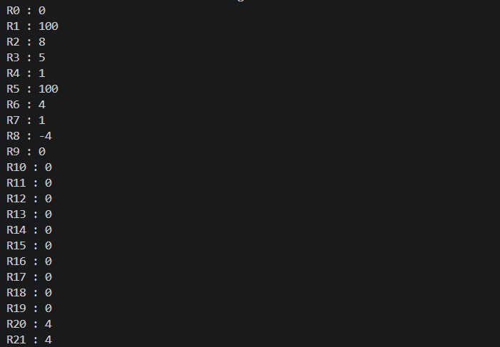

# Athena32 — A 32-bit RISC Instruction Set Architecture

## 1. Introduction

Athena32 is a custom 32-bit RISC instruction set architecture (ISA) that we
designed and implemented from scratch as a team project.

The design follows a classic load/store RISC model. All arithmetic and logic
operations work on registers only, and memory is accessed through the `LW` and
`SW` instructions. Every instruction is exactly 32 bits wide, which keeps the
fetch and decode stages simple.

Main features:

- **32 general-purpose registers**, each 32 bits wide (`R0` is always zero)
- **Fixed 32-bit instruction width** with four instruction formats
- **16 instructions**: a base integer set plus the Multiply/Divide (M) extension
- **Big-endian** byte order
- **Strict trap** behaviour on illegal operations

---

## 2. ISA Design

The figure below shows the four instruction formats, the function codes, and
the full opcode map.


### Instruction formats

| Format | Opcode | Layout |
|---|---|---|
| R-Type | `0` | `op[31:28]` `rd[27:23]` `rs[22:18]` `rt[17:13]` `func[12:10]` `unused[9:0]` |
| I-Type | `1`–`7` | `op[31:28]` `rd[27:23]` `rs[22:18]` `imm[17:0]` |
| J-Type | `8` | `op[31:28]` `rd[27:23]` `offset[22:0]` |
| Extension | `9` | same layout as R-Type |

### Opcode map

| op | Format | Instruction |
|---|---|---|
| 0 | R-Type | `ADD` / `SUB` / `AND` / `OR` / `SLT` (selected by `func`) |
| 1 | I-Type | `ADDI` |
| 2 | I-Type | `ORI` |
| 3 | I-Type | `ANDI` |
| 4 | I-Type | `SW` |
| 5 | I-Type | `LW` |
| 6 | I-Type | `SLTI` |
| 7 | I-Type | `BEQ` |
| 8 | J-Type | `JAL` |
| 9 | Extension | `MUL` / `DIV` / `REM` (selected by `func`) |
| 10–15 | — | free for future instructions |

---

## 3. Test Program

To test the design, we wrote a program that uses most of the instruction set in
one place. The program builds an array of five values in memory, then walks
through it in a loop to compute the sum and the maximum value.

The program covers:

- Arithmetic and logic instructions (`ADDI`, `ADD`, `SUB`, `ANDI`, `ORI`)
- Memory access (`LW`, `SW`)
- Comparison and control flow (`SLT`, `BEQ`)
- The M extension (`MUL`, `DIV`, `REM`)

The first part of the program is listed below. The array is written to
`MEM[100]` up to `MEM[104]`, and the loop then starts reading it back.

### Program and Expected results

#### Test case :  
```
PC= 0, 10800064  ADDI R1, R0, 100             R1 = 0x00000064
PC= 1, 11000004  ADDI R2, R0, 4               R2 = 0x00000004
PC= 2, 41040000  SW R2, 0(R1)                 MEM[100] = 0x00000004
PC= 3, 11000011  ADDI R2, R0, 17              R2 = 0x00000011
PC= 4, 41040001  SW R2, 1(R1)                 MEM[101] = 0x00000011
PC= 5, 11000009  ADDI R2, R0, 9               R2 = 0x00000009
PC= 6, 41040002  SW R2, 2(R1)                 MEM[102] = 0x00000009
PC= 7, 1100002A  ADDI R2, R0, 42              R2 = 0x0000002A
PC= 8, 41040003  SW R2, 3(R1)                 MEM[103] = 0x0000002A
PC= 9, 11000008  ADDI R2, R0, 8               R2 = 0x00000008
PC= 10,41040004  SW R2, 4(R1)                 MEM[104] = 0x00000008
PC= 11,11800005  ADDI R3, R0, 5               R3 = 0x00000005
PC= 12,12000000  ADDI R4, R0, 0               R4 = 0x00000000
PC= 13,1A000000  ADDI R20, R0, 0              R20 = 0x00000000
PC= 14,1A800000  ADDI R21, R0, 0              R21 = 0x00000000
PC= 15,02848000  ADD R5, R1, R4               R5 = 0x00000064
PC= 16,53140000  LW R6, 0(R5)                 R6 = 0x00000004

PC= 17, 0A50C000  ADD R20, R20, R6             R20 = 0x0000004
PC= 18, 03D4D000  SLT R7, R21, R6              R7 = 0x00000001
PC= 19, 73800001  BEQ R7, R0, +1               not taken
PC= 20, 0A980000  ADD R21, R6, R0              R21 = 0x0000004
PC= 21, 12100001  ADDI R4, R4, 1               R4 = 0x00000001
PC= 22, 04106400  SUB R8, R4, R3               R8 = 0xFFFFFFFC
PC= 23, 74000001  BEQ R8, R0, +1               not taken


PC= 24, 7003FFF6  BEQ R0, R0, -10              taken -> PC 15 (infinite loop)
PC= 25, 02848000  ADD R5, R1, R4               R5 = 0x00000068
PC= 26, 53140000  LW R6, 0(R5)                 R6 = 0x00000008  (MEM[104])

```


## 4. Results

### 4.1 Disassembly 

#### From PC : 0 to 23 (NOT TAKEN)


#### From PC : 0 to 24 (TAKEN)



### 4.2 Data Memory

#### From PC : 0 to 23


### 4.3 Register File

#### 4.3.1 Test case From PC =  0 to  16 


#### 4.3.2 Test case From PC =  0 to  23 




---
 

## 5. Design Trade-offs

Every design choice gives us something and costs us something. The three most
important trade-offs in Athena32 are explained below.

### 5.1 A 4-bit opcode field

We use only 4 bits for the opcode, so we can have 16 opcodes in total.

**we gain :** The decoder is very small. It only reads 4 bits to know the
instruction type. This keeps the control logic simple and makes the decode
stage fast.

**we pay :** We already use 10 opcodes, so only 6 are free. If we want to
add many new instructions later, we will run out of space.

### 5.2 An 18-bit immediate with no `func` field in I-Type

The I-Type format gives all 18 remaining bits to the immediate. There is no
`func` field.

**we gain :** The immediate range is large: from -131072 to +131071. Most
constants, memory offsets and branch targets fit into one instruction, so we do not need extra instructions to build big values. Decoding is also easy, because the immediate is one single field.

**we pay :** Without a `func` field, every I-Type instruction needs its own
opcode. `ADDI`, `ORI`, `ANDI`, `SW`, `LW`, `SLTI` and `BEQ` use seven opcodes
for only seven instructions. In R-Type, the `func` field lets five instructions share one opcode. If we moved 3 bits from the immediate to a `func` field, the range would still be large enough (-16384 to +16383). 

### 5.3 A small instruction set and a fixed 32-bit format

We keep only 16 instructions. Every instruction is 32 bits wide, and memory
access works on full words only. R-Type and Extension-Type leave 10 bits
unused.

**we gain :** The hardware stays small. The ALU needs no shifter, and the
memory stage needs no byte enables and no alignment logic. Because all
instructions have the same width, the fetch stage is simple: the PC always
moves by the same step, and instructions are never misaligned.

**we pay :** We waste 10 bits in every R-Type instruction. The bigger
problem is software. We have no shift instructions, so a shift must use `MUL`
or `DIV`  needs many cycles.

---

## 7. Team

| Member |
|---|
| Fatma Alagroudy |
| Islam Ashraf |
| Mohamed Ahmed |
| Yara Magdy |
| Yehia Ahmed |